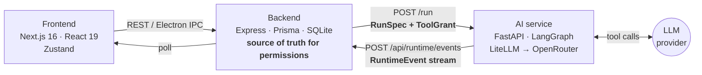
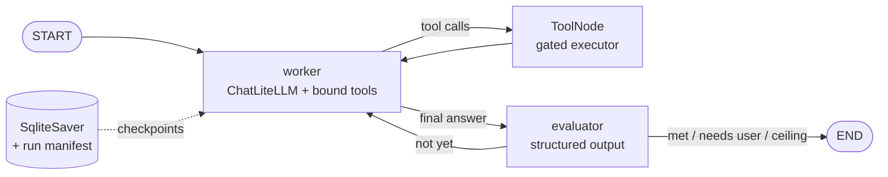
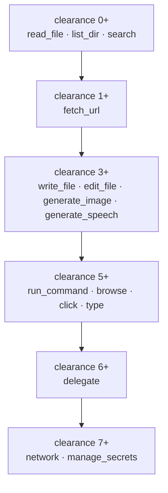
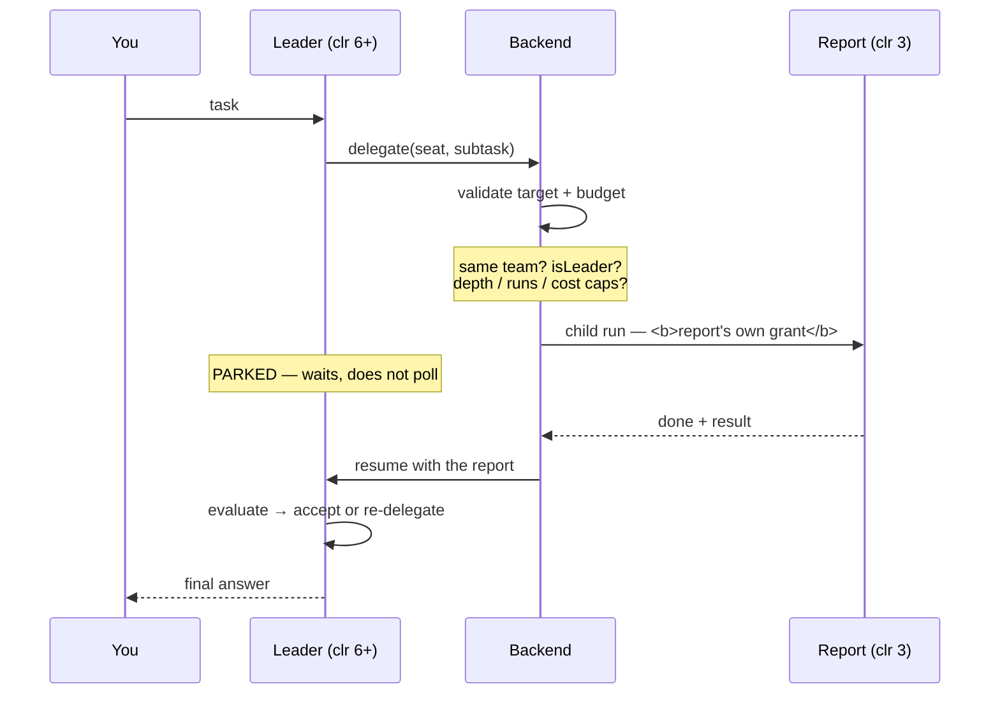
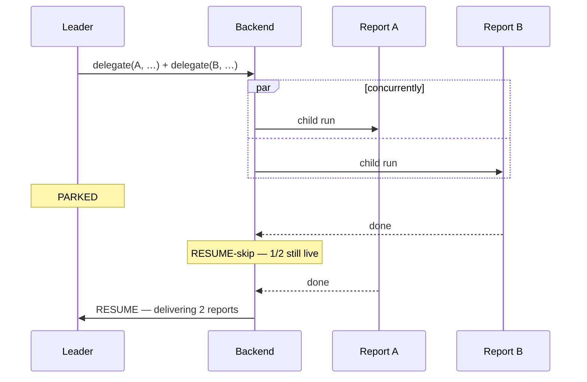

# Sanctorum - Pixel Agents

**An agent operating system where capability is granted by organizational position, not by code.**

Sanctorum is a supervised multi-agent orchestration platform with role-based access control. You
create *roles*, seat *agents* into them, and each agent's real capability — which tools it may call,
which directory it may touch — is computed from the seat it holds. A team leader can delegate work
downward to its own reports — **sequentially or several at once** — and every delegated run executes
at the **subordinate's** clearance, never the leader's.

The gate is enforced in the execution layer, outside the model. An agent without a granted tool has
no code path to it — not a prompt asking it politely to refrain.

---

## Table of contents

**The idea**

- [What makes it different](#what-makes-it-different)
- [How it compares](#how-it-compares)

**How it works**

- [Architecture](#architecture)
- [Guardrails](#guardrails)

**Permissions**

- [The capability model](#the-capability-model)
- [Two axes: clearance and dataType](#two-axes-clearance-and-datatype)
- [Roles and professions](#roles-and-professions)

**Agents**

- [Creating an agent](#creating-an-agent)
- [Personalities](#personalities)
- [Memory](#memory)
- [The starting cast](#the-starting-cast)

**The office**

- [The building](#the-building)

**What agents can do**

- [Features](#features)
- [Choosing a model](#choosing-a-model)
- [Reading the web](#reading-the-web)
- [The agent's browser](#the-agents-browser)
- [Generating images](#generating-images)
- [Speech](#speech)

**Running it**

- [Getting started](#getting-started)
- [Announcements](#announcements)
- [Provider keys are encrypted at rest](#provider-keys-are-encrypted-at-rest)
- [Known limitation: structured output](#known-limitation-structured-output)

**Reference**

- [Project layout](#project-layout)
- [Roadmap](#roadmap)
- [Naming the category](#naming-the-category)
- [Sanctorum vs the field](#sanctorum-vs-the-field)

---

## What makes it different

Most agent frameworks attach capability to the *agent definition* — `researcher = Agent(tools=[search])`.
Roles are prompt strings; the "permission model" is flavor text a model can ignore.

Sanctorum computes capability from org structure at run time:

```
Role (job)  →  Position (seat)  →  Agent (holder)  →  ToolGrant (what it can actually do)
```

Edit a role's clearance and **every seat holding it moves** — the Workday/IAM model, not
copy-at-assign. Three properties fall out of that:

| Property | What it means |
|---|---|
| **Enforcement, not instruction** | An ungranted tool never enters the executor's allow-list. Refusal is structural. |
| **Clearance is never inherited** | A clearance-7 lead delegating to a clearance-2 seat produces a child that genuinely cannot run a shell. |
| **No clearance laundering** | Delegation is downward-on-own-team only, so a shell-less lead can't borrow another team's shell via the delegation edge. |

---

## How it compares

Three categories of prior art, and Sanctorum sits between them.

### Agent frameworks — the libraries

| Framework | What it is | Permission model |
|---|---|---|
| **LangGraph** | Graph orchestration — *Sanctorum is built on it* | None; tools are Python lists |
| **CrewAI** | Role-based crews, with a hierarchical process option | Roles are prompt strings |
| **AutoGen** (Microsoft) | Conversational multi-agent, group-chat patterns | None |
| **OpenAI Agents SDK** | Handoffs between agents; successor to Swarm | None |
| **Claude Agent SDK** | Anthropic's own; strong sandboxing primitives | Per-session, not org-derived |
| **Semantic Kernel** | Planner + plugin model | Plugin-level |
| **MetaGPT / ChatDev** | Simulated software companies with job titles | Titles are flavour text |

**The pattern:** these give you *composition*. None gives you a permission boundary — if an agent has
a shell tool, it has a shell, and "role" is a prompt the model can reinterpret.

MetaGPT is closest in spirit: it literally assigns "CTO" and "Engineer". But those are **personas,
not capability grants** — the CTO and the intern hold the same tools.

> Sanctorum is not a competitor to LangGraph. It is a **governance layer on top of it**: LangGraph
> runs the agent loop, Sanctorum decides what that loop is permitted to touch.

### Coding agents — the products

**Devin · Factory · Cursor / Windsurf agents · GitHub Copilot Workspace · Claude Code · Codex.**

Sandboxed, often well supervised, sometimes multi-agent internally. But they are **single-purpose**
(code) and have no org model — no seat you assign an agent to, no clearance ladder, no delegation
tree you can inspect and cancel.

### Enterprise platforms — the ones with real permissions

**Microsoft Copilot Studio · Salesforce Agentforce · ServiceNow AI Agents.**

These *do* have genuine RBAC, because they **inherit it from existing IAM**. An Agentforce agent is
bound by Salesforce permissions exactly as a user is.

The trade is generality: the agents are workflow automations inside one SaaS product. You cannot
point one at an arbitrary folder and hand it a shell. **The permission model is real; the reach
isn't.**

### Where Sanctorum sits

```
                        generality  →
   high  │   Agent frameworks          ◆ SANCTORUM
         │   (compose freely,            (general-purpose tools,
         │    no permission boundary)     seat-derived RBAC)
         │
   low   │   Coding agents             Enterprise platforms
         │   (sandboxed, one domain)   (real IAM, one SaaS)
         └──────────────────────────────────────────────────
                     permission rigor  →
```

The combination — **enterprise-grade permission rigor with framework-grade generality, as a local
app** — is the position. Four things follow from it that I have not found elsewhere:

| | |
|---|---|
| **Capability from org position** | Not from the agent definition. Reseat the agent, its powers change. |
| **Live role inheritance** | Edit a role's clearance and every seat holding it moves — Workday/IAM, not copy-at-assign. |
| **Clearance genuinely not inherited** | Hierarchical frameworks let a manager's tools flow to workers, because tools ride the agent. Here they ride the seat, so a clearance-7 executive delegating to a clearance-3 writer produces a child that *cannot* run a shell. |
| **Clearance laundering closed structurally** | Lateral delegation would let a shell-less lead borrow another team's shell with no gate firing. Illegal edges are never offered, so the delegation graph stays a strict downward tree. |

**Two honest caveats.** First, "nobody else does this" is a claim about one author's knowledge of a
fast-moving field, not a survey — verify it before staking anything on it. Second, the enterprise
platforms will likely close this gap: they already own the IAM, and bolting on general-purpose tools
is easier than inventing a permission model from scratch.

---

## Architecture

Three processes. Node owns permissions; Python owns the agent loop; the frontend never talks to an
LLM.



**The contract:** Node resolves a seat into a `RunSpec` carrying a `ToolGrant` (allowed tools,
working directory, environment). The AI service executes *within* that grant and streams
`RuntimeEvent`s back. The runtime is injectable — a `StubRuntime` runs the whole app with no Python
and no LLM spend.

### Request flow

```
Component → Hook → Service → API        (going down)
Component ← Hook ← Service ← API        (coming back)
```

No component calls `fetch` directly. `api/client.ts` routes over Electron IPC in the desktop shell
and `fetch` in the browser, so nothing downstream knows which.

### What each process owns

| | **Frontend** | **Backend** | **AI service** |
|---|---|---|---|
| Stack | Next.js 16, React 19, Zustand, Tailwind tokens | Express, Prisma, SQLite | FastAPI, LangGraph, LiteLLM |
| Port | 3000 | 3001 | 8000 |
| Owns | Rendering, stores, the office canvas | **Permissions, org model, run tree, budgets** | The agent loop, tool execution, checkpoints |
| Never does | Talk to an LLM | Run a tool | Decide what an agent is allowed to do |

The AI service is **replaceable**. `AgentRuntime` is an interface; a `StubRuntime` runs the entire
app in-process with no Python and no LLM spend, which is how every security invariant was verified
before a cent was spent.

### The agent loop (LangGraph)

Inside the AI service, one run is a compiled LangGraph graph:



- **worker** — the model with its granted tools bound. Its system prompt is rebuilt each turn so the
  success criterion and the evaluator's latest feedback are always current.
- **ToolNode** — runs tools through `ToolExecutor`, which re-checks the grant on every call. MCP
  tools are merged into this same list, so they are gated identically.
- **evaluator** — a second LLM call returning a *typed* verdict (`with_structured_output`), so the
  graph branches on a hard value rather than hoping the model self-corrects.
- **`interrupt_before=["tools"]`** — what makes supervision work. The graph stops *before* executing a
  tool, with the request already in state: exactly the "about to do X, approve?" moment.
- **SqliteSaver + manifest** — the checkpoint holds the message state; the manifest holds the
  `RunSpec` needed to rebuild the graph. Together they let a paused run survive a service restart.

### Event flow, one supervised run

```
Node: buildRunSpec (seat → clearance → ToolGrant)  →  POST /run (202)
AI:   started → criteria → worker plans → INTERRUPT
        → POST /api/runtime/events { awaiting_approval }
You:  proceed / edit / stop  →  POST /runs/{id}/decision
AI:   resume → tool runs → worker → evaluator → evaluated → done (with cost)
Node: ingestEvent → messages, run status, cost, tree bookkeeping
```

Every event carries `runId`, `threadId` and `agentKey`, which is what lets one thread hold a whole
delegation tree with a lane per agent.

---

## Guardrails

Layered, and each one enforced somewhere the model cannot reach.

| Guardrail | Where | What it stops |
|---|---|---|
| **Tool gating** | `ToolExecutor._allowed` (Python) | An ungranted tool has **no code path** to execution — the model isn't even offered its schema |
| **Path confinement** | `tools/files.py` `_resolve` | `../` escapes are refused even at clearance 8 |
| **Environment allowlist** | `toolPolicy` env | No host secrets reach a run; only `PATH` + OS bootstrap vars, so the shell works without leaking |
| **Read-only mounts** | `toolPolicy` | A real-folder mount strips mutating tools regardless of clearance |
| **Approval pause** | `interrupt_before` | Nothing consequential runs unwatched unless you turn supervision off for that agent |
| **Target validation** | `delegateTargets` | Illegal delegation edges are never *returned*, not returned-then-rejected |
| **Downward-only tree** | `parentTeamId` walk | No upward or sideways delegation → no clearance laundering |
| **Memory read gate** | `memoryService.canRead` | Row-level: a seat sees only entries at or below its clearance; `agent` scope is owner-only, so seniority cannot read a junior's private notes |
| **Memory identity** | `ownerForRun` | The agent sends a scope, never an owner id or an identity — both come from the run, so it cannot read another seat's memory by naming it |
| **Budget caps** | `checkBudget` | Depth, run count and cost bound a whole task |
| **Run serialization** | per-run `asyncio.Lock` | Two decisions arriving together can't spawn duplicate children |
| **Cascading cancel** | `cancelTree` | Stopping a root stops every descendant, deepest-first |
| **Cycle guard** | `wouldCycle` | A team cannot report into its own sub-team |

**The one that matters most:** clearance is resolved from the *seat* through a single resolver
(`positionResolve.effectivePosition`), and two of its readers are security gates — the tool grant and
the memory read. Keeping that rule in one file is what guarantees they agree.

---

## The capability model

Clearance is a ladder. Each rung *adds* capability; a seat gets everything at or below its level.



Two gates guard delegation, and both must pass:

- **Clearance 6+** — senior enough to fan work out.
- **`isLeader` on the seat** — actually their manager. Clearance alone never confers authority over
  other people. Set with the ★ in the Teams manager; the leader's seat is then
  highlighted and carries a **`leader`** label, so the one seat that can delegate is
  visible at a glance rather than inferred from a toggled icon.

Capability can also be **narrowed**, never widened: a read-only workspace mount strips every mutating
tool regardless of clearance.

### Clearance levels

What an agent is allowed to **do**. Nine rungs (0–8); the tool ladder above maps onto them.
Defined in `backend/utils/taxonomy.ts` and validated server-side — the API rejects a level the UI
would never offer.

| Level | Label | Gains |
|---|---|---|
| 0 | Guest / External | `read_file`, `list_dir`, `search`, `read_memory` |
| 1 | Employee / User | **`fetch_url`** *(default for a new agent)* |
| 2 | Power User | — |
| 3 | Supervisor / Team Lead | **`write_file`, `edit_file`, `write_memory`, `generate_image`, `generate_speech`** |
| 4 | Department Manager | — |
| 5 | Department Administrator | **`run_command`**, **`browse`, `click`, `type`, `scroll`, `back`, `read_page`** |
| 6 | System Administrator | **`delegate`** *(with `isLeader`)* |
| 7 | Security Administrator | **`network`, `manage_secrets`** |
| 8 | Super Administrator | — |

Levels without a new rung still matter: they express seniority in the org chart and gate *memory*
reads, even when the tool set is unchanged.

### Data sensitivity levels

What an agent is allowed to **see** — a separate ladder from clearance, fourteen levels deep.
Clearance governs actions; data type governs knowledge. Enforced on every memory read — see
[Two axes](#two-axes-clearance-and-datatype).

| Level | Label | | Level | Label |
|---|---|---|---|---|
| 1 | Public | | 8 | Corporate Secret |
| 2 | Internal *(default)* | | 9 | Strategic Secret |
| 3 | Confidential | | 10 | Black Access |
| 4 | Restricted | | 11 | Cosmic Access (Ultra Classified) |
| 5 | Highly Restricted | | 12 | Omega Access |
| 6 | Executive Only | | 13 | Genesis Access |
| 7 | Board Only | | 14 | Palantir Access (Root Clearance) |

### Delegation limits

Three caps bound a whole delegation tree. They are **snapshotted when the root run starts**, so
editing them never disturbs work already in flight — the next task picks up the new values.

| Setting | Default | Range | Meaning |
|---|---|---|---|
| `maxDelegationDepth` | 3 | **1–10, no unlimited** | How many levels deep delegation may go |
| `maxRunsPerTree` | 12 | ≥0, **`0` = unlimited** | Total agent runs one task may spawn |
| `maxCostPerTree` | $2.00 | ≥0, **`0` = unlimited** | USD ceiling for the whole task |

A fourth cap is **per agent** rather than per tree: `Agent.maxCost`, set in the dossier beside the
trusted-delegator toggle. It bounds that agent's **own subtree** — itself plus everything it
delegates, however deep.

It does not replace the tree ceiling; it **nests inside it**, and both are checked:

> A department cannot outspend the company, and a manager given a tighter budget than the company's
> is bound by their own. **Whichever is lower binds.**

Blank inherits the global ceiling — the same cascade `model` and `imageModel` use. `0` also means
inherit, never "may spend nothing", so a cleared field can't silently forbid an agent from working.

Unlike the tree's caps it is read **live** rather than snapshotted, because an agent's budget is a
standing property of that agent: lowering it should bind the next delegation, not the next task.

**Depth counts levels, not hops.** `maxDepth: 3` permits depths 0, 1 and 2 — which is exactly an
executive → department head → specialist chain. **Depth 2 is the deepest currently reachable**, since
that needs one level of team nesting; depth 3+ would require a sub-team that itself has sub-teams.

**Depth takes no "unlimited"** because it is the only *structural* guard against a delegation cycle.
Runs and cost would stop a loop eventually — but only after burning the whole budget on nonsense.
Two of these are budget dials; one is an invariant.

**Cost is checked between runs, not mid-run.** It stops *starting* new work; a single expensive run
can overshoot. That is `MAX_STEPS`/`max_attempts`' job, not this ceiling's.

**When to tweak them:**

| Situation | Change |
|---|---|
| Flat team, one leader + reports | `depth 1` — forbids delegation entirely, useful for locking a team down |
| Executive over departments | `depth 3` (the default) — fits exactly, with no headroom |
| Long editorial chains with revisions | raise `maxRunsPerTree` to 20–30; rework is the quality mechanism and a low cap severs it |
| Exploratory / expensive models | lower `maxCostPerTree` to $1–2 and let it be the real backstop |
| You trust the setup and want it uncapped | `runs 0`, `cost 0` — depth still clamps at 10 |

A leader is told its remaining run budget in every `delegate` result, so a model that knows it has
three runs left behaves differently from one that doesn't.

---

## Two axes: clearance and dataType

Clearance says what an agent may **do**. `dataType` says what it may **know**.

The second is enforced on **memory reads**, and applies to *every* scope:

| | Gates | Scope |
|---|---|---|
| **Clearance** | the tool ladder, position-scoped memory | the seat |
| **dataType** | every memory read | the agent |

An Executive-Only note stays invisible to an Internal-level teammate **who passes
the team-membership check** — which is the whole point of a second axis.

Agents cannot classify above their own level, for the same reason they cannot
with clearance: it would hide an entry from its own author and from everyone
below. Existing memories default to **1 (Public)**, so nothing became unreadable.

---

## Roles and professions

A **role** is the job, defined once and referenced by many seats: one role, N headcount. "Backend
Engineer" exists as a single row; six seats can point at it. Seats **inherit its title and clearance
live**, so raising a role's `defaultClearance` moves every seat holding it — except seats carrying an
explicit override, which win.

This is the layer that makes the org chart mean something. Clearance answers *what may this seat do*;
the role answers *what is this seat for*, and supplies the default clearance so you are not typing a
number into every seat by hand.

### One list, two surfaces

There used to be two disagreeing lists: a hardcoded dropdown in the dossier and a `Role` table behind
the Roles tab. They are now **one list** — the `Role` table — read by both:

- **Roles tab** (`RoleManager`) — the catalog. Create, edit, delete, grouped by discipline.
- **Dossier ROLE dropdown** (`RoleSelect`) — picks from that same catalog when you assign an agent.

Add a role in the Roles tab and it appears in the dossier dropdown immediately. They cannot drift,
because there is no second source to drift from.

> The taxonomy in `backend/utils/taxonomy.ts` is now only a **seed**, not the runtime list. Nothing
> reads it at request time.

### Anatomy of a role

| Field | Meaning |
|---|---|
| `title` | The job name. **Unique across the catalog** — the API rejects a duplicate |
| `discipline` | The category it files under. **Free text** — see below |
| `defaultClearance` | Clearance a seat inherits unless it overrides (0–8) |
| `level` | Seniority band (0 = unbanded). A free ladder, e.g. 1–6 |
| `description` | What the role is for. Shown when picking |

**A role held by any seat cannot be deleted.** The API refuses with the seat count; reassign those
seats first. Deleting a job out from under a working seat is exactly the kind of silent capability
change this app exists to prevent.

### The catalog you start with

Seeding installs **217 roles across 21 disciplines**:

| Discipline | Roles | Seeded clearance |
|---|---:|---:|
| Business & Operations | 21 | 1 |
| Product & Design | 13 | 2 |
| Research | 5 | 2 |
| Technical Documentation | 3 | 2 |
| Software — Backend | 8 | 3 |
| Software — Frontend | 11 | 3 |
| Software — Full Stack & Desktop | 5 | 3 |
| Embedded & Robotics | 4 | 3 |
| Artificial Intelligence | 15 | 3 |
| Data & Analytics | 12 | 3 |
| Quality Assurance | 8 | 3 |
| Game Development | 10 | 3 |
| Blockchain & Web3 | 5 | 3 |
| Enterprise Applications | 15 | 3 |
| Individual Contributor Track | 9 | 3 |
| Database | 6 | 4 |
| Networking | 7 | 4 |
| Systems & IT | 10 | 5 |
| DevOps & Cloud | 12 | 5 |
| Cybersecurity | 21 | 5 |
| Leadership | 17 | 5 |

Examples: *Accountant*, *AP Clerk* (Business & Operations) · *Backend Engineer*, *API Developer*
(Backend) · *AI Engineer*, *AI Infrastructure Engineer* (Artificial Intelligence) · *Blue Team
Analyst*, *Cloud Security Engineer* (Cybersecurity) · *Chief AI Officer (CAIO)*, *Chief Architect*
(Leadership) · *Intern*, *Junior Engineer*, *Distinguished Engineer* (IC Track).

**Seeded clearances are deliberately conservative.** Nothing is seeded at 6+, where `delegate` and
`manage_secrets` live. A seed that handed out shell access on install would be the wrong default in
precisely the way this project argues against. Granting a leader clearance 6 is a deliberate act in
the Roles tab.

```bash
npm run db:seed:roles     # from backend/
```

A packaged install needs neither command: `seed.db` ships with the floors, the
cast and the full role library already in it — 238 roles across 23 disciplines,
being the 217 professional titles plus the 15 the cast wears and the handful the
demo teams reference.

The seed is **idempotent and non-destructive**. It inserts only titles that do not already exist. A
role you created and tuned — say *Story Lead* at clearance 6 — is never touched, and neither is one
whose title happens to collide: **your clearance wins**, because a seeded default must never silently
move seats that already hold that role. Re-run it after a pull without thinking about it.

### Creating a role

Roles tab → fill the form → **save**.

1. **Title** — must be unique.
2. **Discipline** — type a category. The field suggests ones already in use (see below).
3. **Default clearance** — what seats inherit. Consult the [clearance ladder](#clearance-levels):
   3 to let it write files, 5 for shell, 6 to let it delegate.
4. **Level / description** — optional.

Then point seats at it from the dossier's ROLE dropdown.

### Creating a role category

**A discipline is just a string on the role — there is no separate category table.** Creating a
category means typing a name that doesn't exist yet:

- Type a **new** discipline (e.g. `Fantasy Writing`) → that category appears in the Roles tab the
  moment you save, with your role inside it.
- Type an **existing** one → the role files under it.
- Leave it **blank** → it lands under *Unassigned discipline*.

The list regroups on every render from the roles themselves, so there is nothing to migrate,
register, or clean up. Emptying a category — by deleting or re-filing its last role — makes it
disappear on its own.

The Discipline field offers the disciplines already in use as suggestions while staying free text.
That is a guardrail against fragmentation: without it, `Engineering` and `engineering` become two
sibling groups that look like a bug. Ignore the suggestions whenever you want something new.

**Moving a role between categories** is editing its Discipline field. Both groups re-derive; no seat
is disturbed, because seats reference the role, not its category.

### Collapsing categories

With 200+ roles the catalog is long, so **discipline headers collapse**. Click one to fold it; the
header shows `▾`/`▸` and the role count.

Collapse state is **local view state in the Roles tab** — it never reaches a store, a service, or the
API. The dossier dropdown does its own grouping and cannot observe it, so folding a category in the
catalog never hides a role from anyone assigning one. Newly created disciplines start expanded.

---

## Creating an agent

An agent needs two images and a dossier. Uploads go through `POST /api/agents` as multipart form
data; both files are validated server-side and rejected if malformed.

### The sprite sheet — strict

| Requirement | Value |
|---|---|
| Format | **PNG only** |
| Dimensions | **exactly 192 × 192 px** |
| Layout | **4 columns × 4 rows** of 48 px cells |
| Max size | 8 MB |

Columns are the walk-cycle frames; **rows are facings**. Which row faces which direction is per-agent,
stored as `rowOrder` — default `["down","right","up","left"]`, top row first. If a sheet was authored
in a different order, set `rowOrder` rather than re-cutting the image.

### The portrait

PNG or JPEG, used for the dossier and roster thumbnails. No dimension constraint; same 8 MB limit.

### Dossier fields

| Field | Notes |
|---|---|
| `name`, `key` | `key` is the stable handle used everywhere (sprites, threads, delegation) |
| `title`, `tagline` | Free text, shown in the roster |
| `role` | One of **214 roles** across 21 groups (see below) |
| `clearance` | 0–8, defaults to 1 |
| `dataType` | 1–14, defaults to 2 (Internal) |
| `tenure` | Defaults to "New hire" |
| `focus` | Free text |
| `room`, `seat` | Where they sit — unique per floor, two agents can never share a desk |

**Role groups** (214 roles total): Business & Operations · Software — Frontend · Software — Backend ·
Software — Full Stack & Desktop · Embedded & Robotics · Artificial Intelligence · Data & Analytics ·
Database · DevOps & Cloud · Cybersecurity · Networking · Systems & IT · Quality Assurance ·
Product & Design · Enterprise Applications · Game Development · Blockchain & Web3 · Research ·
Technical Documentation · Individual Contributor Track · Leadership.

> **The dossier `role` is flavour; the seat's Role is capability.** `Agent.role` is a label on the
> person. The `Role` in the role library — referenced by a `Position` — is what resolves to clearance
> and therefore to tools. An agent's real permissions come from the **seat it holds**, never from its
> dossier.

### Optional per-agent settings

| Setting | Effect |
|---|---|
| `model` | Override the global default LLM for this agent |
| `imageModel` | Override the global image model for `generate_image` |
| `speechModel` | Override the global speech model for `generate_speech` |
| `personalityId` | The agent's **voice** — a property of the agent, not the seat |
| `webMode` | Which web tools it is offered: `fetch`, `browse` or `both`; blank inherits the global |
| `maxCost` | USD ceiling for this agent's own delegation subtree; blank inherits the global |
| `dataType` | What it may **know** — gates every memory read |
| `workspaceDir` | Mount a **real folder** instead of the per-floor sandbox |
| `workspaceReadOnly` | Default **true** — strips every mutating tool regardless of clearance |
| `supervised` | Default **true** — pause before each consequential tool |
| `trustedDelegator` | Default **false** — when true, `delegate` skips the pause (other tools still pause) |

---

## Personalities

Who an agent **is** and how it speaks — a fourth prompt-contributing system
beside rules, skills and MCP:

| | Answers | Assigned to |
|---|---|---|
| **Rules** | how we always work | scope (global/team/seat) |
| **Skills** | what you know how to do | the seat |
| **MCP** | what external tools you hold | the seat |
| **Personality** | **who you are and how you speak** | **the agent** |

### The one thing that is not seat-derived

Everything else in Sanctorum comes from the chair: move an agent and its
clearance, skills and servers all change. A voice should not. Move Ebon to
another desk and Ebon still sounds like Ebon — so `personalityId` lives on
`Agent`, and it is the single deliberate exception to the product's own thesis.

### Why it exists

Without one, a persona is a *label*, and the model falls back to its assistant
training the moment it is asked anything reflective. Asked who it was, an agent
replied with three paragraphs on being a language model with no consciousness or
subjective experience — accurate, and nothing to do with the character.

Each personality carries an **identity stance** for exactly that question. The
default:

> If asked directly whether you are an AI, say so plainly in one sentence and
> continue in character. Never claim to be human, and never lecture about it.

Honest, in voice, and one sentence instead of an essay.

### Prompt order

Identity before instruction, which reads better to every model:

```
[personality] → [standing rules] → [role + team] → [skills] → [workspace]
```

### Re-injected on every retry

`_worker_system_prompt` rebuilds each attempt, but it stacks the success
criterion and the evaluator's feedback **after** the system prompt — so by
attempt three the voice is buried under corrections and the model drifts back to
its default tone. A one-line reminder is therefore appended **last**, making it
the final thing read before working.

All 15 of the shipped cast arrive with a voice.

---

## Memory

Knowledge that outlives a run. Agents read it with `read_memory` and write it with
`write_memory`; you read and write the same rows through the UI. It is what makes a team's third
run smarter than its first.

### Three scopes, three different gates

Each scope answers "who may read this?" a different way — and that difference is the design.

| Scope | Belongs to | Who can read it | Gated by | Survives |
|---|---|---|---|---|
| **`agent`** | the individual | **only that agent** | ownership | nothing — it dies with the agent |
| **`position`** | the **seat** | anyone at or above the entry's clearance | **clearance level** | **agent reassignment** |
| **`team`** | the team | every member of that team | membership | agent *and* seat changes |

**Why `position` is the interesting one.** Memory lives on the desk, not the person. Unassign an
agent, seat someone else, and the new holder inherits everything the seat knows. That is the same
principle as capability — a seat carries its clearance, its skills, its MCP servers and its memory,
and whoever occupies it inherits all four.

> **Ownership beats seniority.** A clearance-6 leader cannot read a clearance-3 agent's private
> `agent` notes. Clearance is irrelevant to that scope — only the owner reads it. Verified live.

> **Clearance, on `position`, is not team-bound.** The rule is `ctx.clearance >= row.clearance`,
> so a senior seat on *another* team can read a junior seat's memory if it addresses that owner.
> Team memory is the scope that gates by membership.

### Clearance on entries

Only **position** memory carries a clearance. The write path enforces this:

```typescript
clearance: input.scope === 'position' ? Math.max(0, input.clearance ?? 0) : 0
```

Entries in `agent` and `team` scope are always `0` — a level there would be meaningless, since those
scopes gate by ownership and membership instead.

An agent writing memory **cannot classify above its own clearance**. A clearance-3 seat asking for
level 8 gets an entry stored at 3 — otherwise a junior could write something it could never read
back, and hide it from everyone below that level.

### The four kinds

`task` · `result` · `insight` · `note` — each renders with a distinct dot colour so entries scan
quickly. Agents default to `insight` when they record something themselves; the UI defaults to
`note`.

### Using it from the UI

| Where | Scopes shown |
|---|---|
| **Agent dossier** (click an agent) | `position` (the seat it holds) and `agent` (its private notes) |
| **Teams panel** → a team | `team` (shared by everyone on it) |

The dossier panels are labelled *"(as seen by this agent)"* — reads are gated as that agent, so the
view shows exactly what it would see. **An entry you write above the seat's clearance disappears from
your own view the moment you save it.** That is the gate working, not a bug: you are looking through
a clearance-3 agent's eyes.

Entries written by an agent are marked **`· by <agent>`** in accent colour; ones you typed read
`· manual`.

### Using it from an agent

The run's system prompt lists the scopes the agent holds, so it knows memory exists — an unlisted
capability is an unused one. Then:

```
$ read_memory(scope=team)
→ team memory — 1 of 1 entry:
  - [note] (2026-09-17, by senoj) NAMING CONVENTION for character files…

$ write_memory(scope=team, body="…", kind=insight, clearance=0)
→ Recorded to team memory as a 'insight' (clearance 0).
```

`read_memory` is **clearance 0** — the ladder is the wrong place to gate it, since the row-level
filter already does, and gating it higher would stop an agent reading even its own notes.
`write_memory` sits at **clearance 3**, beside `write_file`: it is durable, others will read it, and
it outlives the run. Under supervision, writes pause for approval; reads don't.

> **The agent never names an owner or an identity.** It sends a *scope*; Node resolves whose memory
> that is from the run id. If it could name an `ownerId` it would read another seat's memory; if it
> could name an `agentKey` it would impersonate a higher-clearance reader — and that identity is
> exactly what the row filter keys on.

### Prompting for it

Agents under-use tools they were not explicitly asked to use. Until you have skills or rules that
build the habit, say so directly:

> *"Read your team memory first. Then … and record that decision to team memory so the rest of the
> team follows it."*

Write **conclusions, not transcripts** — the tool description says so, and it is the difference
between memory that compounds and memory that becomes noise.

---

## The starting cast

A fresh install ships **fifteen characters**. All of them spawn on **HQ**, standing on the portal pad,
and this is the important part:

> **Nobody starts with a desk, a position, or any capability.**
> Every character seeds at clearance 1, data level 2, role "Employee", holding no seat. They are a
> cast, not an org chart.

That is the whole argument of the project expressed in the seed: **capability comes from
organizational position, never from existing.** A character can do nothing until you give it a seat,
and what it can do then is whatever that seat's clearance allows. Seeding fifteen capable agents
would contradict the thing this app is for.

### The cast

| Character | Role | Title | |
|---|---|---|---|
| **Alden** | Archmage | Archmage of the Deep Machinery | Keeps the deep machinery turning, and rarely explains how |
| **Ebon** | Magician | Illusionist of Interfaces | Makes hard things look effortless, which is its own kind of trick |
| **Senoj-Yvad** | Cursed Pirate | Keeper of the Drowned Ledger | Remembers every decision, including the ones you regret |
| **Aeon** | Celestial | Warden of the Long Now | Thinks in decades; occasionally remembers the sprint |
| **Atum** | Primordial | First Cause of All Foundations | Everything downstream depends on work you will never see |
| **Uriel** | Archangel | Sentinel of the Gate | Reads every request twice and trusts none of them |
| **Achion** | Red Dragon | Breath of the Forge | Brought in when something needs to move, loudly |
| **Alissander** | Pawn | Opening Move | Underestimated by everyone who has not watched the endgame |
| **Malok** | Djinn | Bound to the Lamp | Grants exactly what you asked for, which is the risk |
| **Eldrica** | Golden Empress | Warden of the Standard | Holds the line on how things are done here |
| **Rasool** | Emissary | Herald Between Desks | Carries the message intact, including the parts you softened |
| **Manju** | Elder God | Keeper of the Long Ledger | Has read everything, and will remind you what it said |
| **Stewart** | Paladin | Oathkeeper of the Standard | Would rather stop the work than ship the wrong thing |
| **Seshats** | Priestess | Scribe of the Record | Writes it down so the third run is smarter than the first |
| **Nicholas** | Santa | Quartermaster of Deliveries | Knows what everyone needs before they file the request |

Each ships with a role, a title, a tagline and three responsibilities, so a fresh
install reads as a populated office rather than a row of unnamed sprites. All of
it is editable — the dossier is a starting point, not a fixture.

### From Myths and Legends

Those fifteen roles are a **discipline in the role library**, seeded alongside the
217 professional ones. So "Archmage" is a real role: it appears in the Roles tab,
in the dossier dropdown, and can be assigned to a seat, renamed or re-cleared like
any other.

**Every one seeds at clearance 1.** A role named "Archangel" granting more than one
named "Pawn" would make the costume load-bearing, and that is precisely what this
app argues against — capability comes from the seat, never from the title. Raise
one in the Roles tab if you want it to mean something.

**The titles are flavour, not function.** "Sentinel of the Gate" grants Uriel
nothing: put it on a clearance-0 seat and it can read files and nothing else. The
dossier describes; the seat decides.

### Adding your own

Two routes, and they differ in where the character lives:

| | Upload via the dossier | Add to the seed |
|---|---|---|
| Where art lives | `DATA_ROOT/uploads/` (backend) | `public/assets/character/` (repo) |
| Survives a reset | No — database only | Yes — it is source code |
| Ships to a fresh clone | No | Yes |
| Sheet validation | Enforced by the form | None — get it right yourself |

Use the form for characters that are yours; use the seed for characters that are the product's. See
[Creating an agent](#creating-an-agent) for the sprite sheet rules, which the seed route does **not**
check for you.

---

## The building

**Eleven floors** ship seeded, each a 20×20 walkability grid with a background and optional blocking
props. A floor may host **at most one team** (its physical home), and a team may have none.

| # | Floor | Seats | Walkable | | # | Floor | Seats | Walkable |
|---|---|---:|---:|---|---|---|---:|---:|
| 0 | HQ | 33 | 207 | | 6 | Library | 32 | 176 |
| 1 | IT | 32 | 164 | | 7 | Reception | 12 | 173 |
| 2 | Finance | 32 | 163 | | 8 | Dungeon | 11 | 214 |
| 3 | Marketing | 30 | 158 | | 9 | Cave | 10 | 228 |
| 4 | Cafeteria | 60 | 209 | | 10 | Hell | 4 | 222 |
| 5 | Gaming Room | 36 | 171 | | | **Total** | **292** | |

Seat counts are deliberately uneven: the Cafeteria seats 60 because it is a common room, Hell seats
4 because it is not. Every desk is reachable on foot from its floor's portal pad — the seed ships no
floor that violates its own rule (see below).

Floors are editable at runtime — rename, reorder, repaint the walkability grid, place blocking props,
add desks, or create new floors with your own background. The grid is stored as JSON (SQLite has no
array type), `0` = walkable, `1` = blocked.

### Reachability is enforced, not advisory

Every desk must have a walking path to its floor's **portal pad** — the lift tile at `(9, 18)`,
identical on every floor. The editor refuses any stroke that would break this:

- *"that would cut a desk off from the portal"* — blocking that tile would strand a desk. The
  refusal names the stranded seats.
- *"that tile is not walkable"* — you are placing a desk on a blocked tile. Unblock it first.
- *"the portal tile must stay walkable"* — the pad itself is never blockable.

The check is a flood fill from the pad against the grid **plus blocking props**, run with your
proposed change applied. Stranding empty floor is allowed; stranding a *desk* is not, because an
agent seated there could never reach the lift.

The denser a floor, the more tiles become load-bearing — which is why a floor with 32 desks refuses
blocks that the same floor accepted with 6.

### Making a layout permanent

Floors edited in the app live in your database, so a reset or a fresh clone falls back to the seed.
To make a layout the one the product ships with, export it back into source:

```bash
cd backend
npx tsx prisma/exportFloors.ts        # every floor
npx tsx prisma/exportFloors.ts 0 1    # only these floors
```

That rewrites `prisma/rooms.ts` and `prisma/seats.ts` from the live database. Edit in the UI → export
→ commit. Seat ids are renumbered deterministically (`seat_<room>_<index>`, in reading order), because
the editor assigns cuids and the lowest free index as you click — fine in a database, meaningless in
source.

A partial export keeps the floors it was not asked for, so you can ship one floor at a time.

**The floor also decides the sandbox.** An agent with no workspace mount works in
`DATA_ROOT/agent-workspaces/<floor-order>-<floor-name>`, so a team's agents share a space and cannot
reach outside it.

### Delegation



A leader waiting on its reports is mechanically identical to a leader waiting on you — both park the
graph and resume through the same decision endpoint. That reuse is why delegation needed no new
durability layer.

### Parallel fan-out

A leader can also dispatch several reports **in one step**. They run concurrently, in separate
processes with separate checkpoints, and Node joins them: the leader stays parked until the *last*
one finishes, then resumes once with every report batched together.



Each child still runs at **its own seat's** clearance, so fanning out never widens capability — it
only does more work at once.

---

## Features

### Runtime & supervision
- **Clearance-gated tools** — `read_file`, `list_dir`, `search`, `read_memory`, `fetch_url`,
  `write_file`, `edit_file`, `write_memory`, `generate_image`, `generate_speech`, `run_command`,
  `browse`, `click`, `type`, `scroll`, `back`, `read_page`, `delegate` — confined to a working
  directory with a minimal environment.
- **Human-in-the-loop approval** — runs pause before consequential steps: *proceed / edit / stop*.
- **Durable pause** — a SQLite checkpointer plus a run manifest, so a paused run survives a service
  restart.
- **Live hard stop** — cancel a run whether it's paused or mid-flight.
- **Worker–evaluator loop** — a second LLM call grades the answer against a success criterion and
  sends it back with feedback until it passes or hits a retry ceiling.

### Organization
- **Role library** — define a job once; many seats reference it and inherit live.
- **Teams & seats** — one leader per team, highlighted and labelled in the Teams manager; agents
  hold positions.
- **Per-seat skills** — `.md` playbooks injected into the run prompt.
- **Standing rules** — "how we always work," scoped global → team → position, prepended to every run.
- **Personalities** — who an agent *is* and how it speaks. The one thing assigned to the **agent**
  rather than the seat, so a voice survives a desk move. See [Personalities](#personalities).
- **Memory** in three scopes (agent / seat / team) — agents read and write it with tools; the
  seat's memory survives reassignment. See [Memory](#memory).

### Delegation *(Phase 4)*
- **`delegate` tool** — spawns a real child run on a report's seat.
- **Sequential chains** — a leader delegates, waits for the report, evaluates it, and delegates the
  next step with the previous result in hand. Verified live over a four-round chain.
- **Parallel fan-out** — a leader can dispatch several reports **in one step**; they run
  concurrently and their results come back as a single batched report. Verified live.
- **Backpressure** — a leader that has delegated *parks*. It does not poll for files its reports
  haven't written yet, and a decision arriving mid-step is dropped rather than replayed.
- **Budget caps** — depth (1–10), runs per task (`0` = unlimited), cost ceiling (`0` = unlimited),
  snapshotted when a task starts so editing settings never disturbs work in flight.
- **Per-agent budgets** — an agent's own USD ceiling over its whole subtree, nested inside the
  global one. Both are checked and the lower binds: a department cannot outspend the company, and a
  manager with a tighter budget is bound by their own.
- **Cascading cancel** — stopping a root stops every descendant, deepest-first.
- **Cost metering** — per-run USD, summed per delegation tree.
- **Cross-process tracing** — `SANCTORUM_TRACE=1` emits a run-id-tagged line at every delegation
  decision in both Node and Python.

### Operating the fleet
- **Live terminal** per agent — the event stream as a scrolling console.
- **Fleet grid** — every agent as a tile with live status and inline approve/stop/redirect.
- **Run tree** — mission control for one delegation task.
- **Interrupt-and-redirect** — stop a working agent and give it a new instruction.
- **App-drawn title bar** — the window strip carries a pending-approval badge and the open tree's
  live cost, so a supervisor never has to open a panel to learn an agent is waiting on them.
- **Announcements** — a chime or a spoken line when an agent replies or finishes, using the
  platform's own speech engine. Free, instant, offline. See [Announcements](#announcements).

### Configuration
- **Live model picker** — the OpenRouter catalogue, searchable and filterable, with a global default
  and per-agent override for the reasoning, image **and speech** models, and a warning when a
  model cannot call tools (see [Choosing a model](#choosing-a-model)).
- **Image generation** — `generate_image` at clearance 3, writing into the agent's workspace, with
  its cost metered into the task's budget (see [Generating images](#generating-images)).
- **Speech** — `generate_speech` at clearance 3, over OpenRouter's `/audio/speech` endpoint, with
  per-model voices and estimated cost metered the same way (see [Speech](#speech)).
- **The agent's browser** — a real browser at clearance 5, using Electron's own Chromium rather than
  a bundled one. Elements are addressed by number, not coordinates (see
  [The agent's browser](#the-agents-browser)).
- **Encrypted provider keys** — stored through the OS keychain (DPAPI on Windows, Keychain on macOS).
- **Reading the web** — `fetch_url` at clearance 1, the other half of `search`: it opens a page and
  returns its text, behind an SSRF guard that refuses loopback, private and link-local addresses
  even across redirects (see [Reading the web](#reading-the-web)).
- **Per-agent budgets** — an agent's own USD ceiling covering everything it delegates, nested inside
  the global one; the lower binds (see [Delegation limits](#delegation-limits)).
- **Provider keys in-app** — stored in the DB, masked in the UI, preferred over the service's env.
- **External MCP servers** — registered centrally, assigned to seats, merged into the tool list and
  gated exactly like built-in tools.
- **Personalities** — a voice per agent, injected ahead of the role and re-sent on every retry
  (see [Personalities](#personalities)).
- **Announcements** — a chime or a spoken line when an agent replies or finishes, using the
  platform's own speech engine (see [Announcements](#announcements)).
- **Themeable** — light/dark presets driven entirely by CSS custom properties.

---

## Choosing a model

The picker proxies the live OpenRouter catalogue with a global default and a
per-agent override. There are **two independent cascades**, because an agent
reasons with one model and draws with another:

| | Global | Per-agent |
|---|---|---|
| **Reasoning** — must call tools | Settings → Default model | Dossier → Model → Reasoning |
| **Image** — must produce pictures | Settings → Image model | Dossier → Model → Image |

See [Generating images](#generating-images) for the image side. For reasoning
models, two badges matter:

| Badge | Meaning |
|---|---|
| `tools` | The model can call functions. **Required for any seated agent.** |
| `no tools` | It cannot. A seated agent on this model fails every run. |
| `vision` | It accepts images as input. Informational — Sanctorum does not send images to a model today. |

### Why `tools` is not optional

Sanctorum sends the seat's tool schemas on **every** run, because capability comes
from organizational position. Even clearance 0 grants four tools — `read_file`,
`list_dir`, `search`, `read_memory` — so there is no such thing as a seated agent
that sends none.

Give one a model that cannot call functions and the provider refuses the request
outright:

```
No endpoints found that support tool use. Try disabling "read_file".
```

Search-and-synthesis models (Perplexity's Sonar family) and many image-focused
models fall in this group: they are built to answer or to describe, not to operate
software. Roughly 69 of the 445 models cannot call tools.

The dossier warns when an agent's chosen model lacks tool support **and** it holds
a seat, and the AI service translates that provider error into plain language
rather than surfacing raw JSON.

### `tools: true` is not a guarantee

OpenRouter's `supported_parameters` is a **union across a model's providers**, not
a promise about the one your request routes to. The same model can be served by
several backends that disagree:

```
meta-llama/llama-3.3-70b-instruct   →  tools: true

  DeepInfra    tools ✓        Parasail     tools ✗
  Novita       tools ✓        Cloudflare   tools ✗
  AkashML      tools ✓        SambaNova    tools ✗
```

OpenRouter filters to the qualifying endpoints at routing time — the
`failed_routing_step: ... by Tool Compatibility` you may see in an error.

So the flag is reliable in one direction only. **`false` means it will fail**,
which is what the warning is based on; **`true` means it should work**, and very
occasionally will not. That is why the runtime error path still exists and still
explains itself.

### Cost

A failed run is still a billed run. The provider charges for the request before
the tool-compatibility check rejects it, so testing an incompatible model is not
free — a single Sonar Deep Research attempt cost $0.45.

---

## Reading the web

`search` returns five titles, links and ~200-character snippets. Without a way to
open one of those links an agent can discover that a page exists but never read it
— so `fetch_url` is the other half, at **clearance 1**:

```
fetch_url(url="https://example.com/docs/api")
→ the page, markup stripped, article text extracted
```

One rung above `search` on purpose: search returns curated results from one
provider, while `fetch_url` opens an **arbitrary address the model chose**. It only
observes, so it is in the read-only tool set — a read-only mount is a promise about
the *user's files*, not a vow of silence towards the internet.

It is deliberately **not a browser**: no JavaScript, no clicking, no forms, no
logging in. That covers documentation, articles and READMEs at roughly a
ten-thousandth the cost of driving a real browser with a vision model.

### The SSRF guard is the whole security story

An agent that can fetch any URL can fetch `http://localhost:3001/api/agents` — the
app's **own backend** — and read the org it is a member of. Or a cloud metadata
endpoint at `169.254.169.254`.

Every hop is resolved and checked against the **resolved IP**, not the text of the
hostname, because a hostname can resolve to loopback and a public URL can *redirect*
to one. Redirects are therefore followed by hand and re-validated at each hop:

```
http://localhost:3001/api/agents              → refused
http://169.254.169.254/latest/meta-data/      → refused
http://192.168.1.1/                           → refused
file:///C:/Windows/System32/.../hosts         → refused
https://public.example/→ http://localhost/    → refused at the redirect
```

`ipaddress.is_global` is the single test, rather than a remembered denylist of
ranges: it excludes loopback, link-local, private, multicast, reserved and
unspecified for both IPv4 and IPv6, and the stdlib keeps it correct.

---

## The agent's browser

At **clearance 5** an agent gets a real browser: JavaScript runs, sessions
persist, and pages that refuse `fetch_url` work normally.

### It uses the browser already running

Electron **is** Chromium. Bundling Playwright would ship a *second* one — about
150 MB per platform — to drive the browser this app is rendered in. So the agent
gets a `WebContentsView`, and the installer does not grow at all.

(`<webview>` is the other option and is deprecated in Electron 33;
`WebContentsView` is the supported surface.)


### Sessions belong to the agent

Each agent browses in its own persistent partition, so it stays logged in
between runs and two agents never share cookies — the seat-derived idea applied
to browser state. **Sign out** in the pane clears one agent's storage.


### Choosing between text and the browser

An agent offered both `fetch_url` and `browse` will usually pick `fetch_url` —
it is cheaper and the model has no way to know you wanted to *watch*. So which
tools it gets is a **setting**, not a hint:

| Mode | The agent gets | For |
|---|---|---|
| **`fetch`** *(default)* | `fetch_url` only | plain documents; most work |
| **`browse`** | the six browser tools only | JavaScript-heavy sites, watching, staying logged in |
| **`both`** | both, and chooses | trusting the model to decide |

Set globally in **Settings → Web access**, overridden per agent in its dossier —
the same cascade `model`, `imageModel` and `speechModel` use.

**A mode narrows; clearance gates.** The ladder runs first, then a read-only
mount, then the mode — so an agent below clearance 5 set to `browse` gets
**nothing web at all**, because the rung already removed the browser and a mode
can only subtract. And because a tool absent from `allowedTools` has no code
path, this is enforcement, not a suggestion the model can reconsider.

> Setting an agent to `browse` **removes** `fetch_url`, so a plain text read now
> costs roughly 10x more. That is the trade, and the dossier says so.

**`search` stays available in every mode**, and that matters: a mode that removed
it would break the natural flow — search finds the page, `browse` reads it.

It does mean the tool DESCRIPTIONS have to earn their keep. An agent in browse
mode once answered a question entirely from search snippets and never opened a
page, because `search` described itself as returning "top results" — which reads
like an answer. It now says snippets *locate* a page and must never be quoted
from, and `browse` names its place in the flow. That is persuasion rather than
the structural enforcement `ToolPolicy` gives, so it is worth re-checking after a
model change.

### What it will not do

There is no form-submit shortcut and no stored payment. An agent can fill a cart
and reach the payment page; **the irreversible click is yours.** That is not a
gap — `maxCostPerTree` counts API tokens and cannot see a purchase, and there is
no undo for one.

---

## Generating images

An agent at **clearance 3 or above** can call `generate_image` and write a picture
into its workspace, alongside the files it writes with `write_file`.

```
generate_image(path="art/lighthouse.png", prompt="A tall red lighthouse on a
               windswept cliff at sunset, painterly fantasy style…")

→ wrote art\lighthouse.png (1488 KB) using openrouter/black-forest-labs/flux.2-flex
  — cost $0.0500
```

### The agent does not draw — it delegates to a model that can

Almost no model does both jobs. A reasoning model calls tools and cannot produce
pictures; an image model produces pictures and usually cannot call tools. So the
agent stays on its own model and the **tool** dispatches a separate call:

```
Ebon (Claude Sonnet 5)  ──calls generate_image──►  tool
                                                    │
                                   ──── separate call ───► FLUX.2 Flex
                                                    │
                                   ◄──── PNG bytes ──┘
                                                    ▼
                                    <workspace>/art/lighthouse.png
```

This is why the picker keeps two catalogues that never mix: choosing a drawing
model as an agent's brain, or a reasoning model as its image model, are both
configuration errors, and both are impossible in the UI.

### Where the file goes

Into the agent's **workspace directory** — the real folder set on its dossier, or
its default sandbox. The write goes through the same path guard every other write
uses, so an image cannot land outside that directory:

```
'art/logo.png'         → written
'../escaped.png'       → refused
'C:/Windows/evil.png'  → refused
```

A **read-only** workspace mount blocks the tool entirely. Generating a file into a
folder you promised only to observe would break that guarantee, so `generate_image`
is deliberately absent from the read-only tool set.

### Cost counts against the task's budget

Images are not cheap — roughly **4¢** for Gemini 2.5 Flash Image, **5¢** for FLUX.2
Flex — so an unmetered tool would quietly make `maxCostPerTree` a lie.

The tool reads the cost the provider returns and reports it into the run's tracker,
the same total that gates further delegation. A run that generates three images and
writes a file is metered as one figure, and the tree's ceiling sees all of it. Cost
is recorded even when generation **fails**, because the provider still bills — a
ceiling that ignored failed attempts could be evaded by failing repeatedly.

### Choosing the image model

Two rungs, mirroring how reasoning models already work:

| | Where | Falls back to |
|---|---|---|
| **Global** | Settings → **Image model** tab | the AI service's env default |
| **Per-agent** | Dossier → Model → **Image** tab | the global setting |

Leave both unset and the service default applies. There are **54** image models in
the catalogue — FLUX, GPT Image, Nano Banana, Recraft, Seedream — and the picker
shows only those when choosing an image model.

> The main OpenRouter catalogue **omits pure image models**: a model whose output is
> only images does not appear in `/models` and shows up only under
> `?output_modalities=image`. Sanctorum fetches both and merges them, which is why
> the catalogue is 488 models rather than 445.

---

## Speech

An agent at **clearance 3 or above** can call `generate_speech` and write spoken
audio into its workspace — the same rung as `generate_image`, for the same reason:
producing media writes a file and spends real money.

```
generate_speech(path="audio/intro.mp3", text="Welcome to Sanctorum.")
→ wrote audio/intro.mp3 (14 KB) using openrouter/hexgrad/kokoro-82m,
  voice af_alloy — estimated cost $0.0006
```

Confinement, the read-only rule and the two-rung model cascade all work exactly as
they do for images: **Settings → Speech model** globally, **Dossier → Model →
Speech** per agent, blank inherits.

### It does not use the chat endpoint

This is the one place speech genuinely differs from images. Sending a TTS model to
`chat/completions` is refused outright:

> `hexgrad/kokoro-82m is a text-to-speech model and cannot be used with the
> chat/completions endpoint. Use the /api/v1/audio/speech endpoint instead.`

That is **18 of the 22** speech models. The other four (`gpt-audio`, `lyria`) are
conversational models that emit audio from `chat/completions` and require
`stream: true` to do it. So `/audio/speech` is the primary path and the chat shape
is the fallback — the reverse of what the image tool does.

> **Two modality names mean "sound."** OpenRouter labels dedicated TTS models
> `output_modalities: ['speech']` (18) and conversational ones `['audio']` (4). The
> two queries return **disjoint** sets, so both are fetched. Checking only one name
> finds only that group — which is how this first showed 4 models instead of 22.

### Voices are per-model, and sometimes mandatory

`minimax` refuses without one ("An explicit voice is required for this TTS
provider"); `kokoro` is happy to default. The valid list is in each model's
`supported_voices`, which Sanctorum fetches once and caches — so an unknown voice is
corrected against the real list instead of becoming a 400 the agent cannot act on.

### Cost is estimated, not reported

`/audio/speech` returns **no cost header at all**. Rather than record nothing, the
tool estimates from the input length and reports that — erring high on purpose:

> A ceiling that silently stops counting is worse than one that is approximate. The
> error should be a stopped agent, not an overspent budget.

Output is requested as **MP3**. The endpoint's default is raw `audio/pcm`, which is
14× larger and opens in no ordinary player because it carries no header; `wav` and
`opus` are both rejected.

---

## Getting started

### Download

Tagged releases are built on GitHub Actions and attached to the
[Releases page](../../releases) — one job per platform, because the AI service
is a PyInstaller bundle and Prisma's query engine is native, and neither
cross-compiles.

| Platform | File | Status |
|---|---|---|
| **Windows 10/11** (x64) | `Sanctorum-Setup-<version>.exe` | **verified** |
| **macOS Apple Silicon** — M1, M2, M3, M4, M5 | `Sanctorum-<version>-arm64.dmg` | **verified on an M4** |
| macOS Intel | `Sanctorum-<version>-x64.dmg` | builds; not yet run on hardware |

One arm64 build covers **every** Apple Silicon Mac, including the Pro, Max and
Ultra variants — the generations differ in cores and clocks, not in instruction
set. Intel Macs need the x64 build; Rosetta translates x64 → arm64, never the
other way.

**Verified on macOS means:** installed from the dmg, both services started
(`backend ready on 3001`, `aiservice ready on 8000`), all 31 migrations applied,
15 agents seeded, and an agent answered a message.

**The builds are unsigned.** Windows shows a SmartScreen warning — *More info*
then *Run anyway*. macOS refuses them outright, so after dragging the app to
Applications:

```bash
xattr -cr /Applications/Sanctorum.app
```

macOS 10.15 or later. Signing removes both steps and needs only repository
secrets, not a workflow change.

> **If the app does not start on macOS**, launch it from Applications rather than
> a Dock icon. A Dock alias added while the app was still on the Desktop or a
> mounted disk image keeps pointing there; re-drag it from `/Applications`. To see
> why anything failed, run it with a console attached:
>
> ```bash
> /Applications/Sanctorum.app/Contents/MacOS/Sanctorum
> ```

### Prerequisites

To build from source: Node 20+, [uv](https://docs.astral.sh/uv/) for Python, and
an [OpenRouter](https://openrouter.ai) key for real LLM calls.

### Install

```bash
npm run install:all     # root + backend + frontend + the Python service
npm run db:seed         # floors, teams, the role library and the cast
npm run db:seed:roles   # the 217-role professional taxonomy
```

### Configure

```bash
cp aiservice/.env.example aiservice/.env
```

Set `OPENROUTER_API_KEY` there (or enter it in the app's settings panel, which takes precedence).
In `backend/.env`, set `AISERVICE_URL=http://localhost:8000` to use the real runtime — leave it unset
and the app runs on the stub with no LLM spend.

### Run

Two modes. Browser mode is the fast loop; desktop mode is what ships.

```bash
npm run dev            # browser: backend + frontend (stub runtime, no LLM spend)
npm run dev:all        # browser: all three, with real LLM calls
npm run dev:electron   # desktop: Electron owns the backend and AI service
```

| Service | Port |
|---|---|
| Frontend | 3000 |
| Backend | 3001 |
| AI service | 8000 |

**Do not run `dev` and `dev:electron` at once.** In desktop mode the Electron main
process spawns the backend and the AI service itself, so a second copy would fight
over port 3001 — and Electron's orphan cleanup would kill the wrong one.
`dev:electron` starts only Next.js for that reason.

### The desktop app

Electron wraps the same three processes: it spawns the backend and AI service as
children, serves the frontend over an `app://` protocol in production, and bridges
the renderer to both over IPC. `api/client.ts` already routes through
`window.electronAPI` when it is present, so nothing in the frontend changes
between modes.

```bash
npm run desktop      # build everything and launch from the static export
npm run pack         # unpacked build in release/win-unpacked, for inspection
npm run dist:win     # NSIS installer + zip  (also dist:mac)
```

`dist:win` produces `Sanctorum-Setup-<version>.exe` — a wizard with Start Menu
and desktop shortcuts, an Add/Remove Programs entry and an uninstaller —
alongside a zip for anyone who would rather not run an installer. It installs
per-user into `%LOCALAPPDATA%`, so there is no UAC prompt; the build is
unsigned, so SmartScreen will warn about an unknown publisher.

**Uninstalling leaves `%APPDATA%/Sanctorum` alone.** That is where the user's
own database lives — their org, memory and run history — so reinstalling finds
that work intact. A genuinely clean first-launch test means deleting that
folder by hand.

| Piece | Where |
|---|---|
| Main process, IPC, service spawning | `electron/main.ts` |
| The `electronAPI` bridge | `electron/preload.ts` |
| First-launch database setup | `electron/database.ts` |
| Packaging config | `electron-builder.yml` |

#### The title bar

The OS title bar is replaced by a React component, so that ~32px of permanently
visible space carries something a supervisor needs — whether an agent is blocked
on their decision, and what the open delegation tree has spent — rather than the
app's own name.

The two platforms are treated differently, because only one of their conventions
can safely be broken:

| | Windows / Linux | macOS |
|---|---|---|
| Window config | `frame: false` | `titleBarStyle: 'hiddenInset'` |
| Who draws the buttons | we do (Lucide) | the OS (traffic lights) |
| Layout consequence | 8px right pad when maximized | 78px left inset |

Hand-drawing traffic lights would break Option-hover, Mission Control and
green-means-fullscreen, which Mac users notice immediately. `hiddenInset` keeps
them native and floating over the content — what Slack, Notion, Linear and Arc
all do. Windows has no equivalent convention to violate.

**Resizing survives.** `frame: false` removes the visible chrome, not the
hit-testing: Electron keeps an ~8px invisible grip on every edge and corner while
`resizable` is true. Edge-drag resize, `Win`+arrow, drag-to-edge snapping and
double-click-to-maximize all still work. The one real loss is the Windows 11
hover-over-maximize snap-layouts flyout, which needs `WM_NCHITTEST` and so a
native module.

**The frontend never checks the platform.** The main process decides the chrome
and describes it over `window:state`; `windowService` resolves that into pixel
values, and `TitleBar` renders them. When the macOS path is tested on real
hardware, the correction lands in one constant in one file.

| Layer | File |
|---|---|
| Window config + IPC | `electron/main.ts` |
| Bridge | `electron/preload.ts` |
| API | `frontend/api/window.ts` |
| Service (resolves the platform difference) | `frontend/services/windowService.ts` |
| Hook | `frontend/hooks/SharedModuleHooks/useWindowControls.ts` |
| Components | `frontend/components/layout/TitleBar.tsx`, `SupervisionStatus.tsx` |

In a browser (`npm run dev`) there is no window to control, so no bar renders at
all — `controls: 'none'` rather than three buttons that would do nothing.

> **If a control in the bar stops responding**, it is almost certainly missing
> `-webkit-app-region: no-drag`. The strip is a drag region, and a drag region
> swallows clicks from anything that has not opted out.

The AI service is packaged as a PyInstaller bundle (`aiservice/aiservice.spec`),
because a user's machine has neither the repo nor `uv`. `npm run build:aiservice`
builds it; the packaging scripts run it for you.

### Databases

Three files, and telling them apart matters:

| | What |
|---|---|
| `backend/database/dev.db` | **Your** development database. Never shipped. |
| `backend/database/seed.db` | **Build output.** What ships. Gitignored; regenerate with `npm run seed:db`. |
| `<userData>/database/app.db` | **The user's** database, copied from `seed.db` on first launch. |

`seed.db` is built by `scripts/buildSeedDb.js`: it migrates a fresh database, runs
the seed, then refuses to write the result if it is oversized or holds a single
thread, message, run or memory entry. Building the shipped database rather than
maintaining one removes the risk of shipping your own conversations — there is
nothing to remember to clean.

On first launch the desktop app copies `seed.db` into the user's data directory,
backs it up before every later launch, applies pending migrations and re-runs the
seed (which is idempotent, so a release that adds a floor or a role delivers it
without a reinstall). If any of that fails it restores the backup and refuses to
start, rather than let the user write into a half-migrated schema.

Because `seed.db` already carries the full migration history, **a new user arrives
with zero pending migrations** instead of running all of them on a machine we
cannot debug.

### Debugging

Set `SANCTORUM_TRACE=1` in both `backend/.env` and `aiservice/.env` for a timestamped, run-id-tagged
trace of every delegation decision across both processes. Set `PRISMA_LOG_QUERIES=1` only when you
need the SQL — it's very loud.

---

## Announcements

A sound when an agent replies or finishes, set in **Settings → Announce**:

| Mode | Sounds like | Cost | Latency | Offline |
|---|---|---|---|---|
| **Chime** *(default)* | two soft tones | free | instant | ✓ |
| **Voice** | "Alden sent a message" | free | instant | ✓ |
| Off | — | — | — | — |

**Deliberately not the `generate_speech` tool.** That costs money per call, takes
a round trip and needs a key. A UI notification must be free, instant and work
offline, so both engines are built into the platform: WebAudio synthesises the
chime (no asset to package), and `speechSynthesis` — **SAPI on Windows,
AVSpeechSynthesizer on macOS** — speaks the line in whichever voice the user has
already configured for their system, including their accessibility settings.

**Chime is the default, not voice.** A spoken line on every reply is charming for
an hour and irritating by the third day; a sound you can ignore is better
background than words you cannot.

### It is a per-machine preference

Stored in `localStorage`, not `AppSettings`. Every other setting is a property of
the **org** and belongs in the database — the default model is the same wherever
you open the app. Whether *this machine* makes noise is a property of the machine:
the same user on a laptop in a meeting and a desktop at home wants different
answers, and a synced value would be wrong in one of them.

### What triggers it

Nothing pushes to the browser — `useInbox` polls — so an announcement is a **diff
between polls**: a thread whose `unread` went up, or whose `activeRunId` went
null. Deliberately silent for the first poll (a baseline, or a window opening onto
ten unread threads would fire ten times), for the first few seconds after launch,
when the *user* reads a message, and for a thread that did not exist before. Two
threads changing at once produce **one** announcement, not two.

---

## Provider keys are encrypted at rest

Keys entered in Settings are encrypted by the OS: **DPAPI on Windows, Keychain on
macOS**, through Electron's `safeStorage`. The ciphertext is bound to the
logged-in user, so another account on the same machine gets nothing.

The crypto lives in the main process, because `safeStorage` is an Electron API
and the backend is a plain Node child — so the backend asks over a loopback
endpoint authenticated with a per-launch token that is never written to disk.

Stored values carry an `enc:v1:` prefix, which is what makes the migration
invisible: a key written before this existed has no prefix and keeps working
until it is next saved. Outside Electron (`npm run dev`) there is no keyring and
values stay plaintext — the settings panel says which mode is in effect.

> This stops a file being read. It does not stop a process running **as you**,
> which can always ask the OS to decrypt. For a single-user desktop app that is
> the right boundary.

---

## Known limitation: structured output

The evaluator grades every finished run using structured output, which needs a
model that reliably returns JSON. A reasoning model without solid structured-output
support can do the work correctly and then fail the run at the last step with
`OUTPUT_PARSING_FAILURE` — the file is written and the money spent, but the run is
marked failed. Claude and the other major models are fine; if you see that error,
the agent's **reasoning** model is the cause, not the image or speech one.

---

## Project layout

```
sanctorum/
├── backend/               Express · Prisma · SQLite — owns permissions
│   ├── runtime/           AgentRuntime contract, ToolPolicy (the clearance ladder)
│   ├── database/          Prisma client + module services
│   ├── routes/            REST surface
│   └── prisma/            Schema, migrations, seed
├── frontend/              Next.js · React · Zustand
│   ├── api/               HTTP layer (Electron IPC aware)
│   ├── services/          Business logic, patches the stores
│   ├── hooks/             Component-facing seams
│   ├── components/        UI, theme tokens only
│   └── store/             Zustand stores
├── aiservice/             FastAPI · LangGraph · LiteLLM
│   ├── src/sanctorum_aiservice/
│   │   ├── graph/         The agent graph, checkpointer, supervision, cost
│   │   ├── tools/         The gated executor
│   │   └── runtime/       Pydantic mirror of the TS contract
│   ├── aiservice.spec     PyInstaller bundle for the packaged app
│   └── launcher.py        Frozen entry point (relative imports need a parent)
├── electron/              Desktop shell
│   ├── main.ts            Window, IPC, service spawning, app:// protocol
│   ├── preload.ts         The electronAPI bridge
│   ├── database.ts        First-launch copy, backup, migrate, seed
│   └── assets/            App icons (ico · icns · png)
├── scripts/
│   └── buildSeedDb.js     Builds the database that ships
└── electron-builder.yml   Packaging config
```

---

## Roadmap

- **Cross-team requests** — lead asks lead, both approve, work runs under the *receiving* team's
  clearance. Deliberately *not* a relaxation of the downward-only rule: it is a separate mechanism
  with its own approval flow. Nesting reduces the need for it, since most "cross-team" work is really
  up-and-over through a shared parent.
- **Deeper nesting** — depth 2 is reachable today (executive → department → specialist). Depth 3+
  needs a sub-team that itself has sub-teams; the cap already permits up to 10.

---

## Naming the category

| Audience | Framing |
|---|---|
| **Engineering** | Multi-agent orchestration runtime with capability-based security and human-in-the-loop supervision |
| **Business** | AI workforce management — hire, seat, and supervise agents like employees |
| **Academic** | Hierarchical multi-agent system with organizational role theory and delegated authority |
| **Security** | Policy-enforcement point for LLM agents: RBAC, sandboxed execution, mandatory approval gates |

The two phrases carrying the most weight are **agent orchestration** (the delegation and supervision
machinery) and **RBAC** (the seat → role → clearance → grant chain). The second is the real
differentiator: plenty of things orchestrate agents; almost nothing gates them with a permission
model borrowed from IAM.

The emerging industry term is *agentic workforce* or *AI agent governance* — and **governance** is the
honest one here, because the gate is enforced outside the model rather than requested inside a prompt.

---

## Sanctorum vs the field

Researched September 2026. Star counts and capabilities move fast — treat the
numbers as a snapshot, not a scoreboard.

Eighteen projects get called "AI agent platform," and they are not doing the
same thing. Grouped by what they actually are:

### 1. Supervised multi-agent desktop apps — the direct comparison

| | Sanctorum | [Munder Difflin](https://github.com/chaitanyagiri/munder-difflin) | [Mission Control](https://github.com/MeisnerDan/mission-control) | [Agentglass](https://github.com/SirAllap/agentglass) |
|---|---|---|---|---|
| **Stars** | — | 7.7k | 947 | 313 |
| **License** | AGPL-3.0 | MIT | AGPL-3.0 | MIT |
| **Runs its own agent loop** | ✅ LangGraph | ❌ wraps CLIs | ❌ wraps Claude Code | ❌ observes only |
| **Pixel office** | ✅ | ✅ | ❌ | ❌ |
| **Org-chart permissions** | ✅ | ❌ flat | ❌ roles, not hierarchy | ❌ |
| **Approval before each tool** | ✅ | ✅ | ✅ | ✅ |
| **Per-agent cost ceiling** | ✅ | ✅ | ✅ | ✅ (tracking) |
| **Watchable browser** | ✅ | ❌ | ❌ | ❌ |
| **Desktop app** | ✅ | ✅ | ❌ web | ✅ |
| **Signed builds** | ❌ | ✅ notarized | n/a | ❌ |

These four solve the same problem. The differences are real but narrow —
everyone here has approval gates and spend limits; the question is what a
permission is *derived from*.

### 2. Personal AI operating systems — bigger scope, flatter permissions

| | [OpenJarvis](https://github.com/open-jarvis/OpenJarvis) | [Hermes](https://hermes-agent.org/) | [CORE](https://github.com/RedPlanetHQ/core) | [taOS](https://github.com/jaylfc/taOS) | [Space Agent](https://github.com/agent0ai/space-agent) |
|---|---|---|---|---|---|
| **Stars** | **10.1k** | **140k** | 2.0k | 543 | 1.4k |
| **License** | Apache 2.0 | open | AGPL-3.0 | AGPL-3.0 | MIT |
| **The idea** | local-first agents, Stanford-backed | persistent assistant, 15 messaging platforms | always-on memory + runtime | distributed compute cluster | one agent that rewrites its own skills |
| **Hierarchy** | ❌ | ❌ profiles | ❌ | ⚠ per-agent keys, access matrices | ❌ |
| **Watchable browser** | ❌ | ❌ | ✅ isolated | ❌ | ✅ |
| **Desktop app** | ✅ Tauri | self-host | self-host | web desktop | ✅ |

**[Hermes](https://hermes-agent.org/)** is the giant — 140k stars, the most-used
agent on OpenRouter, with gateways into Telegram, Slack, WhatsApp, Signal,
Matrix, iMessage and nine more. Reach is its story, not supervision.

**[OpenJarvis](https://github.com/open-jarvis/OpenJarvis)** comes out of
Stanford's Hazy Research, and treats **energy, latency and cost as first-class
constraints** — the only project here evaluating on watts.

**[CORE](https://github.com/RedPlanetHQ/core)** is the closest in ambition to
Sanctorum's "always on, watching" framing, with a temporal knowledge graph over
email, meetings and Slack. No org chart; human approval is per-task.

**[taOS](https://github.com/jaylfc/taOS)** is the only other project here with
**inter-agent access-control matrices** and per-agent secrets — though it
arrives via distributed-cluster plumbing rather than an org model.

### 3. Visualisers — a surface, not a runtime

| | [Pixel Agents](https://github.com/pixel-agents-hq/pixel-agents) | [Star Office UI](https://github.com/ringhyacinth/Star-Office-UI) |
|---|---|---|
| **Stars** | 9.4k | 7.5k |
| **What it does** | animates real Claude Code sessions | pixel office fed by an API |

Both render agents at work beautifully and run nothing. Nothing to permission,
nothing to budget — and both have more stars than most entries in group 1.

### 4. Voice assistants — a different product entirely

| | [ethanplusai/jarvis](https://github.com/ethanplusai/jarvis) | [adewaskar/jarvis](https://github.com/adewaskar/jarvis) | [SentinelAI](https://github.com/sammyboi1801/SentinelAI) |
|---|---|---|---|
| **Stars** | 787 | 151 | 6 |
| **License** | non-commercial | MIT | MIT |
| **Shape** | voice over Claude Code, macOS only | browser voice UI, Iron Man styling | terminal "think-plan-act" loop |
| **Agents** | single | single | single |

All three are one assistant you talk to. Included because they are called
"agents," but a single voice assistant is not a multi-agent platform — the
comparison ends at the name. Each has human-in-the-loop approval for
consequential actions, which is the one idea they share with Sanctorum.

### 5. Commercial and enterprise

| | [GrokBot](https://x.ai/) | [Databricks Genie](https://www.databricks.com/product/genie/one) | [Trev's Agents](https://trevsagents.com/) | [Hostinger Agent](https://www.hostinger.com/ai) |
|---|---|---|---|---|
| **Model** | subscription | enterprise | $29.99/mo | tiered, bundled with hosting |
| **The bet** | each agent gets its own **cloud computer**, signed into your tools, running while your laptop is off | governed data access via Unity Catalog | 14 prebuilt "money-making" agents, no-code | one assistant across support, SEO, content, legal |
| **Permissions** | ❌ maximum autonomy | ✅ row/column-level, audited | ❌ | ❌ |

**[GrokBot](https://x.ai/)** is the clean opposite of Sanctorum's bet: no
approval step, maximum autonomy, trust placed in the vendor rather than in a
permission model.

**[Databricks Genie](https://www.databricks.com/product/genie/one)** is the only
entry with a permission model as serious as Sanctorum's, and it is far more
mature — but it governs **data**, not tools, and it is cloud enterprise software
rather than something one person installs.

---

### What is actually distinct here

**Capability from position.** Eighteen projects, and the permission model is
almost always attached to the *agent* — a settings panel, an autonomy slider, a
config file. Sanctorum computes it from `Role → Position → Agent → ToolGrant`,
so editing a role moves every seat holding it, and a delegated run executes at
the **subordinate's** clearance, never the leader's. Only Databricks (for data)
and taOS (via access matrices) come close.

**Two axes.** Clearance says what an agent may *do*; `dataType` says what it may
*know*. Nothing else here separates them.

**Approval that means something.** The browser addresses elements by number, so
an approval reads `click [button 18] "Buy now"` rather than a coordinate. And a
tool outside the grant has no code path — refusal is structural, not a prompt.

### What the field does better

- **Hermes** has 140k stars and reaches fifteen messaging platforms. Sanctorum
  has one window.
- **OpenJarvis** has Stanford behind it and measures **energy per task**.
- **Munder Difflin** ships signed, notarized builds on three platforms.
- **Pixel Agents** and **Star Office UI** each have more stars than most working
  runtimes in this list, for drawing the work rather than doing it.
- **GrokBot** runs while your machine is off.
- **Databricks** has audit logs, compliance, and a decade of governance work.
- **CORE** and **taOS** both ship memory architectures more developed than this
  one's three scopes.

The honest summary: Sanctorum's permission model is the most developed of the
open-source entries, and its distribution is the least.

---

## License

Copyright (C) 2026 ablancq95

Licensed under the **GNU Affero General Public License v3.0** — see [LICENSE](LICENSE).

You may use, modify and redistribute this software freely. The one obligation that matters in
practice: **if you run a modified version as a network service, you must make your source available
to its users** (AGPL §13). That clause is the reason this license was chosen over MIT — it keeps
Sanctorum open even when it's operated as a hosted platform rather than distributed as code.
